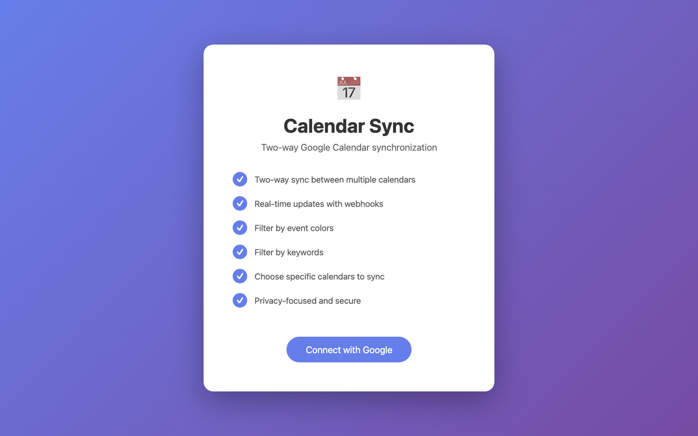
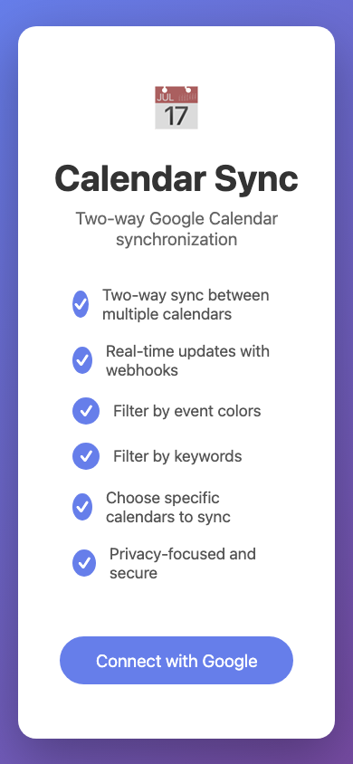

# Calendar Sync App

[](https://railway.com/deploy/6GeBmy?referralCode=q_ltY0&utm_medium=integration&utm_source=template&utm_campaign=generic)

A two-way Google Calendar synchronization application that allows you to sync events between multiple Google calendars in real-time, with advanced filtering options.

## Screenshots

### Home (Desktop)



### Home (Mobile)



### Dashboard (Unauthenticated Redirect View)


## Features

✅ **Two-Way Sync**: Changes in either calendar automatically sync to the other  
✅ **Real-Time Updates**: Uses Google Calendar webhooks for instant synchronization  
✅ **Color Filtering**: Exclude events by color (e.g., ignore all "Lavender" colored events)  
✅ **Keyword Filtering**: Skip events containing specific keywords  
✅ **Calendar Selection**: Choose from primary or secondary Google calendars  
✅ **One-Way Mode**: Option to sync in only one direction  
✅ **Initial Sync Scope Control**: Choose new events only, or backfill recurring events from the last 2 months plus all present/future events  
✅ **Event Copy Controls**: Toggle titles, description, location, meeting links, reminders, privacy, RSVP states, and free/busy behavior  
✅ **Event Identifier Support**: Add static text to cloned events  
✅ **Backfill Re-Run Action**: Safely rerun missed backfill from the dashboard  
✅ **Rate Limit Resilience**: Automatic retry/backoff for Google API 429/quota-style responses  
✅ **OAuth Failure Safeguard**: Auto-disables a sync after repeated `invalid_grant` failures  
✅ **Token Encryption Support**: OAuth tokens can be encrypted at rest with `TOKEN_ENCRYPTION_KEY`  
✅ **Privacy-Focused**: Stores only required sync metadata and event mapping IDs  

## Quick Start

### Prerequisites

- Node.js 18+ installed
- PostgreSQL database (Railway provides this automatically)
- Google Cloud Console project with Calendar API enabled

### Local Development

1. **Clone and Install**
   ```bash
   cd calendar-sync-app
   npm install
   ```

2. **Set up Google OAuth**
   - Go to [Google Cloud Console](https://console.cloud.google.com/)
   - Create a new project or select existing one
   - Enable the Google Calendar API
   - Create OAuth 2.0 credentials (Web application)
   - Add authorized redirect URIs:
     - `http://localhost:3000/auth/google/callback` (local)
     - `https://your-app.railway.app/auth/google/callback` (production)

3. **Configure Environment**
   ```bash
   cp .env.example .env
   ```
   
   Edit `.env` and add your credentials:
   ```env
   DATABASE_URL="postgresql://<db_user>:<db_password>@<db_host>:5432/<db_name>"
   GOOGLE_CLIENT_ID="your-client-id.apps.googleusercontent.com"
   GOOGLE_CLIENT_SECRET="your-client-secret"
   GOOGLE_REDIRECT_URI="http://localhost:3000/auth/google/callback"
   SESSION_SECRET="generate-a-random-string"
   TOKEN_ENCRYPTION_KEY="set-a-long-random-string-for-token-encryption"
   PUBLIC_URL="http://localhost:3000"
   ```

4. **Set up Database**
   ```bash
   npm run db:push
   ```

5. **Run the App**
   ```bash
   npm run dev
   ```

   Open [http://localhost:3000](http://localhost:3000)

## Deploy to Railway

### Step 1: Push to GitHub

```bash
git init
git add .
git commit -m "Initial commit"
git remote add origin https://github.com/yourusername/calendar-sync-app.git
git push -u origin main
```

### Step 2: Deploy on Railway

1. Go to [Railway.app](https://railway.app/)
2. Click "New Project" → "Deploy from GitHub repo"
3. Select your repository
4. Railway will detect it as a Node.js app

### Step 3: Bootstrap Railway Service (Recommended)

Railway deploy-from-GitHub does not automatically attach a database or generate a public domain from repository config alone. Run this once after linking your project:

```bash
railway link -e production
npm run railway:bootstrap
```

This script:
- creates a `Postgres` service (if missing)
- wires `DATABASE_URL`
- generates a public domain (avoids "unexposed service")
- sets `SESSION_SECRET`, `TOKEN_ENCRYPTION_KEY`, `NODE_ENV`, and `PUBLIC_URL`

### Step 4: Configure Environment Variables

In Railway project settings, add these environment variables:

```
GOOGLE_CLIENT_ID=your-client-id.apps.googleusercontent.com
GOOGLE_CLIENT_SECRET=your-client-secret
GOOGLE_REDIRECT_URI=https://your-app.railway.app/auth/google/callback
NODE_ENV=production
INTERNAL_CRON_TOKEN=<long-random-string>
```

`GOOGLE_REDIRECT_URI` can be omitted if `PUBLIC_URL` (or Railway public domain vars) is set, but Google Cloud must still allow:
- `https://your-app.railway.app/auth/google/callback`

### Step 5: Update Google OAuth Settings

1. Go back to Google Cloud Console
2. Add your Railway URL to authorized redirect URIs:
   - `https://your-app.railway.app/auth/google/callback`

### Step 6: Deploy

Railway will automatically build and deploy your app. Once deployed, click the generated URL to access your app!

## Operations

### Health Endpoints

- `GET /health` returns a lightweight runtime status payload
- `GET /ready` verifies DB connectivity plus critical production config like `PUBLIC_URL`, token encryption, and the protected renewal token

### External Webhook Renewal Trigger

The app now supports a protected renewal endpoint so webhook renewal does not need to depend only on in-process cron:

```bash
curl -X POST \
  -H "Authorization: Bearer $INTERNAL_CRON_TOKEN" \
  https://your-app.railway.app/webhook/internal/renew
```

Recommended usage:
- keep the built-in cron enabled as a fallback
- schedule the protected endpoint from an external scheduler once per day
- monitor `/ready` to confirm `internalRenewalTokenConfigured` and `webhookRenewalScheduled`

### GitHub Actions Scheduler

The repo now includes `.github/workflows/webhook-renewal.yml`, which can trigger the protected renewal endpoint on a daily schedule and via manual dispatch.

Configure these GitHub Actions secrets:

```bash
APP_BASE_URL=https://your-app.railway.app
INTERNAL_CRON_TOKEN=<same token configured in Railway>
```

### Alert Delivery

Alerts are throttled and always logged as structured events. To send them to an external system, set:

```bash
ALERT_WEBHOOK_URL=https://your-alert-endpoint.example.com
```

Current alert categories include:
- repeated `invalid_grant` failures
- sync disablement after repeated auth failures
- webhook processing failures
- webhook renewal failures
- initial backfill failure

You can verify alert delivery with the protected internal test endpoint:

```bash
curl -X POST \
  -H "Authorization: Bearer $INTERNAL_CRON_TOKEN" \
  https://your-app.railway.app/webhook/internal/test-alert
```

## Usage

### Creating a Sync

1. Log in with Google
2. Click "Create New Sync"
3. Select source and target calendars
4. Choose sync direction (one-way or two-way)
5. Choose initial sync scope:
   - New events only
   - Backfill recurring events from the last 2 months and all present/future events
6. Configure event copy options (titles/description/location/meeting links/privacy/reminders/RSVP/free events)
7. (Optional) Add keyword filters
8. (Optional) Select colors to exclude
9. Click "Create Sync"

### Filtering Examples

**Keyword Filtering:**
- Add "Personal", "Private", or "Confidential" to skip those events
- Case-insensitive matching

**Color Filtering:**
- Select colors you want to exclude (e.g., "Graphite" for all-day events)
- Events with selected colors won't be synced

### How It Works

1. **Initial Sync**: You can start with new events only, or run a bounded backfill (last 2 months recurring + all present/future events)
2. **Webhooks**: Google Calendar notifies us of changes in real-time
3. **Smart Sync**: Only syncs events that pass your filters
4. **Loop Prevention**: Events created by sync are marked to prevent infinite loops
5. **Two-Way**: If enabled, changes flow in both directions
6. **Safe Recovery**: You can manually rerun missed backfill without recreating the sync

## Architecture

```
┌─────────────────┐
│  Google OAuth   │
│   & Calendar    │
│      API        │
└────────┬────────┘
         │
    ┌────▼─────┐
    │  Express │
    │  Server  │
    └────┬─────┘
         │
    ┌────▼─────────┐
    │  PostgreSQL  │
    │   Database   │
    └──────────────┘
```

**Tech Stack:**
- **Backend**: Node.js, Express, TypeScript
- **Database**: PostgreSQL with Prisma ORM
- **Auth**: Google OAuth 2.0
- **Frontend**: EJS templates, vanilla JavaScript
- **Deployment**: Railway

## Database Schema

- **User**: Stores Google OAuth tokens
- **Sync**: Sync configurations with filters
- **SyncedEvent**: Tracks which events are synced
- **Session**: User sessions

## API Endpoints

### Authentication
- `GET /auth/google` - Initiate Google OAuth
- `GET /auth/google/callback` - OAuth callback
- `GET /auth/logout` - Logout

### Syncs
- `GET /sync` - List all syncs
- `POST /sync` - Create new sync
- `DELETE /sync/:id` - Delete sync
- `PATCH /sync/:id/toggle` - Pause/resume sync
- `PATCH /sync/:id/filters` - Update filters
- `POST /sync/:id/rerun-backfill` - Re-run missed backfill safely in background

### Webhooks
- `POST /webhook/google` - Google Calendar webhook notifications
- `POST /webhook/internal/renew` - Protected manual/external webhook renewal trigger

## Troubleshooting

### Webhooks Not Working

- Ensure `PUBLIC_URL` is set to your public Railway URL
- Railway apps must be publicly accessible for webhooks
- Check webhook expiration (auto-renewed every 24 hours)

### Events Not Syncing

- Check if filters are blocking events
- Verify both calendars are accessible
- Check sync status in dashboard

### OAuth Errors

- Verify redirect URI matches exactly in Google Console
- Ensure Calendar API is enabled
- Check OAuth consent screen is configured

### Known Issues and Field Fixes (March 2026)

- Edit modal shows wrong source account (for example, `[freeBusyReader]`) even after re-auth.
  - Cause: the same calendar can appear under multiple connected accounts, and older UI selection matched only by `calendarId`.
  - Fix: deploy a version that selects edit options by both `calendarId` and `accountId`, then hard refresh the dashboard.
- Events get copied as `Busy`/blank title or are skipped with "no visible details".
  - Cause: selected source account has `freeBusyReader` access (or event privacy hides details).
  - Fix: reconnect/select a source account with at least `reader` access to the source calendar and verify the sync points to that account (`sourceGoogleAccountId`).
  - Current behavior: placeholder summaries like `busy`, `no title`, `untitled` are treated as non-copyable and safely skipped.
- Need to clean up previously bad cloned events in destination.
  - Safe approach: only delete events in the destination calendar that were created by this sync (`privateExtendedProperty syncId=<SYNC_ID>`) and only from a chosen start date.
  - Do not run broad calendar deletes; always scope by both destination calendar ID and sync ID.

### Deploy Checklist for These Fixes

- Pull latest `main` and deploy.
- Confirm Railway `web` service is healthy after deploy.
- Re-auth any disconnected Google account.
- Re-run backfill from dashboard for affected syncs.
- Verify logs show `Created synced event` and no mass `freeBusyReader` skips for the affected sync.

## Development

```bash
# Run in development mode with auto-reload
npm run dev

# Build for production
npm run build

# Start production server
npm start

# View database
npm run db:studio
```

## Security & Privacy

- ✅ OAuth tokens stored encrypted in database
- ✅ No event content stored (only metadata for sync tracking)
- ✅ Minimal Google Calendar permissions requested
- ✅ HTTPS enforced in production
- ✅ Session-based authentication
- ✅ Automatic sync disable safeguard after repeated revoked-token (`invalid_grant`) failures

## Cost Savings

This app helps you save money by replacing paid calendar sync services like:
- 1cal.io ($48/year)
- Reclaim.ai ($8-12/month)
- CalendarBridge ($5-10/month)

**Railway Costs**: ~$5/month (with generous free tier)

## License

MIT License - feel free to use and modify!

## Support

For issues or questions, create an issue on GitHub.

---

Built with ❤️ to save money on calendar subscriptions!
